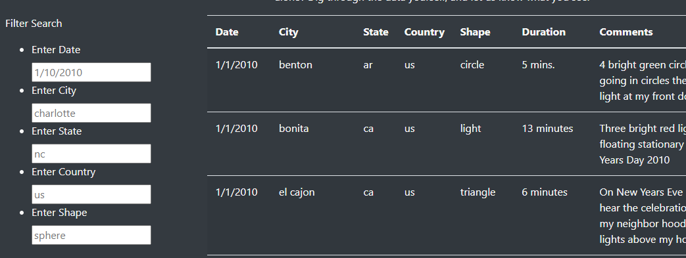
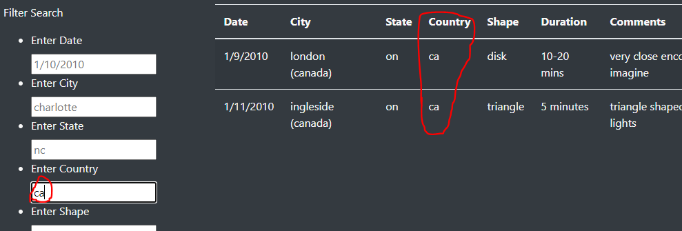

# UFOs Sightings and Filterable Table

## Overview:
Since the beginning of recorded history, there have been accounts of humans seeing unidentified flying objects in the night's sky. With the creation of the internet, it is easier than ever for people to share sightings of these phenominom and for UFO enthusiasts to find data about them. In this project our objective was to take sighting information recorded in a javascript file and present it tabularly through html. Doing so should allow UFO entuhsiasts to look for patterns and form their own ideas about what's really going on.

## Analysis:
For this project we did not perform any direct calculations on the data, but made it presentable in a table that is 1. filterable for a number of criteria and 2. easily sharable in the form of a webpage. 

## Results:

Page Filter:  

 

The webpage filters can be used to filter through the city, state, country, UFO shape, and the date of the sighting. By entering one of these parameters and hitting the Tab button, the search filter will update to show only the results forthat criteria. There are examples in each filter to display the format used. For example, by entering "ca" in the country field we can limit the results to only Canada.

Results for Canada: 

 

This will owrk for any of the fields, and the filtered fields can be added together to refine the search further. To reset the table, you will need to remove the filters and reload the page.

## Summary:
A filterable table was successfully created that could sort through the UFO sighting data to concentrate and find specific information easily. However, there are still some drawbacks to the current version of this table. The most important drawback at the moment is that when the filters are removed the table does not reset automatically. It would be reccomended to add a a way for table to reset automatically as soon as the filter is removed. It would also be nice to be able enter ranges or multiple criteria to widen search results in some cases.

